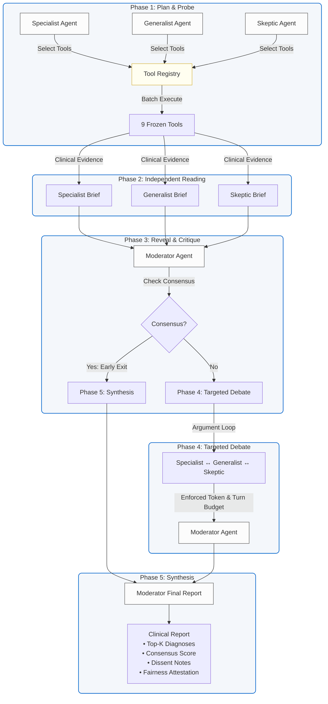

# DermArbiter ⚖️🩸

[](https://www.python.org/downloads/)
[](LICENSE)
[]()
[](https://github.com/langchain-ai/langgraph)
[]()

> **Training-Free, Multi-Agent Collaborative Debate Framework for Equitable Dermatological Diagnosis**

DermArbiter orchestrates four heterogeneous Large Language Models (LLMs) in a structured five-phase debate protocol to produce accurate, explainable, and fair dermatological diagnoses — **without requiring any additional model training or fine-tuning**. By combining frozen foundation-model tools with a novel debate architecture, DermArbiter achieves competitive diagnostic performance while providing built-in fairness guarantees across Fitzpatrick skin types I–VI. The framework is config-driven, fully reproducible, and easily extensible to new agents, tools, and benchmarks.

---

## 📸 Overview & Architecture

DermArbiter operates on a structured multi-agent state machine built with **LangGraph**. The debate is organized into five distinct clinical phases:



### The 5-Phase Debate Protocol:
1. **Plan & Probe**: Agents receive case metadata (and optional clinical image) and independently choose relevant clinical tools from the **Tool Registry** (e.g., specialized classifiers, RAG components, or custom probes). Selected tools are executed in parallel.
2. **Independent Reading**: Each agent studies the raw tool outputs and constructs a structured **Clinical Brief** containing a differential diagnosis, confidence ratings, and reasoning.
3. **Reveal & Critique**: The Moderator reviews all briefs. If a unanimous consensus exists with high confidence, the debate triggers an **early-exit** directly to synthesis. Otherwise, it proceeds to active debate.
4. **Targeted Debate**: Under a strict token budget and structured turn-taking, agents argue, defend, and critique their respective positions, modifying their views in response to evidence.
5. **Synthesis**: The Moderator compiles a final clinical report including a Top-K differential diagnosis, a consensus agreement score, and a robust **Fairness Attestation**.

---

## 🌟 Key Features

- 🧠 **Training-Free Multi-LLM Debate** — Achieves top-tier performance without expensive fine-tuning.
- 🛠️ **9 Specialized Frozen Tools** — Integrates state-of-the-art vision models, knowledge graphs, and RAG databases.
- ⚖️ **Fairness-by-Design** — Integrates our novel **Fairness Probe** to check for Fitzpatrick skin type bias and ensure equitable outcomes.
- 🔍 **Calibrated Uncertainty** — Leverages our **Uncertainty Probe** to flag clinically ambiguous cases for human intervention.
- ⚡ **Structured State Machine** — Powered by LangGraph for deterministic state transitions and robust error handling.
- ⚙️ **Config-Driven Architecture** — Configure models, prompt strategies, and debate parameters entirely via YAML files.
- 📊 **Reproducible Experimentation** — Built-in test harness, ablation runners, and statistical metrics calculators.
- 🧪 **Mock Mode Support** — Develop and test the entire debate pipeline locally without GPU resources or API keys.

---

## 👥 Agent–Model Mapping

DermArbiter maps distinct clinical roles to specialized LLMs to emulate a real-world multidisciplinary tumor board or case discussion:

| Agent | Model | Backend | Core Clinical Role |
| :--- | :--- | :--- | :--- |
| **Specialist** | Gemini 2.5 Flash | Google Gemini API | Deep domain-expert dermatological analysis and lesion feature extraction |
| **Generalist** | MedGemma 4B | Local HF (GPU) | Broad medical knowledge base and contextual patient history processing |
| **Skeptic** | Qwen3-8B-Instruct | Local HF (GPU) | Adversarial challenge, highlighting edge cases and alternative hypotheses |
| **Moderator** | Gemini 2.5 Flash | Google Gemini API | Debate synthesis, consensus calculation, and final report generation |

---

## 🧰 The Tool Pool

Agents query a rich registry of diagnostic tools to support their claims. DermArbiter incorporates 9 frozen tools, including two novel contributions:

| # | Tool | Module | Source | Description |
| :-: | :--- | :--- | :--- | :--- |
| 1 | **PanDerm Classifier** | `panderm_tool.py` | [PanDerm](https://github.com/SiyuanYan1/PanDerm) | Foundation vision-language model for multi-class skin lesion classification |
| 2 | **MAKE Annotator** | `make_tool.py` | [MAKE](https://github.com/CristianoPatrwa/MAKE) | Extracts structured morphological attributes (e.g., ABCDE criteria) |
| 3 | **DermoGPT VQA** | `dermogpt_tool.py` | [DermoGPT](https://github.com/Frankunv/DermoGPT) | Specialized VQA engine for localized dermatological queries |
| 4 | **MedGemma VQA** | `medgemma_tool.py` | [MedGemma](https://ai.google.dev/gemma/docs/medgemma) | General medical VQA for systemic clinical question answering |
| 5 | **Guideline RAG** | `guideline_rag.py` | Internal | RAG retrieval over clinical practice guidelines (DermNet NZ, Mayo Clinic) |
| 6 | **Case RAG** | `case_rag.py` | Internal (ChromaDB) | Retrieval of similar cases from historical patient databases (Derm1M) |
| 7 | **Ontology Graph** | `ontology_graph.py` | Internal | Validates vocabulary and maps diagnoses to SNOMED-CT / ICD-10 codes |
| 8 | **Fairness Probe** ★ | `fairness_probe.py` | **Novel Contribution** | Evaluates demographic parity and equalized odds across Fitzpatrick types |
| 9 | **Uncertainty Probe** ★ | `uncertainty_probe.py` | **Novel Contribution** | Quantifies prediction uncertainty and checks calibration metrics |

> ★ **Novel Contribution**: Introduced in this work to enforce safety, calibration, and equity in medical AI systems.

---

## 🚀 Quick Start

### 📋 Prerequisites

- Python $\ge$ 3.10
- Optional: CUDA-capable GPU (Required for real local model execution; optional in `--mock` mode)
- API key for Google Gemini (Google AI Studio)

### ⚙️ Installation

1. Clone the repository:
   ```bash
   git clone https://github.com/furkanahi/DermArbiter.git
   cd DermArbiter
   ```

2. Copy and configure the environment variables:
   ```bash
   cp .env.example .env
   # Edit .env with your GOOGLE_API_KEY and optional HF_TOKEN
   ```

3. Install the package in editable mode with development dependencies:
   ```bash
   pip install -e ".[dev]"
   # Or using poetry / make:
   make install
   ```

### 🧪 Run the Pipeline in Mock Mode (No GPU or API Keys Required!)

Validate the orchestrator state machine, agent coordination, and reporting pipeline in seconds:
```bash
python scripts/run_e2e_gpu.py --mock --query "Changing asymmetrical pigmented mole on back"
```

### 🧪 Run unit and integration tests

Validate the code health of all core, agent, tool, and evaluation modules:
```bash
make test
# Or run with pytest directly:
pytest tests/ --tb=short
```

---

## 📖 Usage Examples

### 🔍 Run a Single-Case Diagnosis

```bash
# Mock Mode (runs instantly with mock data)
python scripts/run_e2e_gpu.py \
    --mock \
    --query "Asymmetrical dark lesion with irregular borders on leg"

# Real Mode (requires GPU and API keys)
python scripts/run_e2e_gpu.py \
    --config configs/ \
    --image data/sample_lesion.jpg \
    --query "Scaling erythematous plaque on the extensor surface of the elbow" \
    --age 45 \
    --sex male \
    --fitzpatrick 3
```

### 📊 Reproducible Benchmarking

Evaluate DermArbiter against baselines on clinical datasets:

```bash
# Run benchmarking harness on sample cases (in mock mode)
make benchmark-mock

# Perform statistical analysis of the benchmarking runs
make analyze

# Calculate diagnostic metrics (Accuracy, Top-K, Calibration curves)
make evaluate

# Calculate fairness metrics (Stratified performance, Demographic Parity)
make fairness
```

### 🔬 Run Tool Validation & Smoke Tests

Ensure all 9 wrappers, model drivers, and APIs are ready:

```bash
# Simple check
make validate-tools

# Exhaustive check with mock inputs
python scripts/validate_tools.py --smoke-test --verbose
```

---

## 📁 Project Directory Structure

```
DermArbiter/
├── configs/                  # Config-driven execution setup
│   ├── agents.yaml           # Agent LLM configurations & debate settings
│   ├── benchmarks.yaml       # Benchmark split paths & metrics
│   ├── default.yaml          # Global execution, logging, and token limits
│   └── tools.yaml            # Tool-specific weight paths & thresholds
├── dermarbiter/              # Main package directory
│   ├── core/                 # State-machine, debate protocol, and shared blackboard
│   │   ├── orchestrator.py   #   LangGraph debate state-machine definition
│   │   ├── blackboard.py     #   Shared state data structures
│   │   └── debate_protocol.py#   Phase 1-5 execution code
│   ├── agents/               # LLM agent definitions (Specialist, etc.)
│   ├── tools/                # Specialized diagnostic tools (1-9)
│   ├── evaluation/           # Evaluation metrics, RAG checkers, and fairness tools
│   └── experiments/          # Ablation studies and batch runner wrappers
├── scripts/                  # Command Line Interface (CLI) scripts
│   ├── run_e2e_gpu.py        #   E2E execution CLI
│   ├── validate_tools.py     #   Tool diagnostic tool
│   └── setup_colab.py        #   Colab cloud environment builder
├── notebooks/                # Step-by-step developer guides
│   ├── 02_agent_demo.py      #   Demo of individual agent workflows
│   └── 03_full_pipeline_demo.py# Demo of the entire E2E pipeline
├── tests/                    # Robust 428-test suite
└── Makefile                  # Task Automation (test, format, benchmark, etc.)
```

---

## ⚙️ Configuration Setup

DermArbiter is fully parameterized via files inside the `configs/` directory.

- `default.yaml`: Global runtime options, output paths, seed, and device setting.
- `agents.yaml`: Individual temperature parameters, debate token limits, prompts, and weights.
- `tools.yaml`: Paths to embedding files, database configurations, and remote API models.
- `benchmarks.yaml`: Definition of metrics, evaluation targets, and dataset parameters.

---

## 📈 Supported Clinical Benchmarks

DermArbiter is evaluated on several clinical dermatology datasets:

| Dataset | Evaluation Focus | Case Count | Skin Tones Stratified | Source Citation |
| :--- | :--- | :--- | :--- | :--- |
| **HAM10000** | 7-class lesion diagnostic accuracy | 10,015 images | — | [Tschandl et al. (2018)](https://doi.org/10.1038/sdata.2018.161) |
| **Derm7pt** | Multi-criteria clinical diagnosis | 1,011 cases | — | [Kawahara et al. (2019)](https://doi.org/10.1109/JBHI.2018.2824327) |
| **SkinCon** | Concept-based diagnostics | 3,230 images | — | [Daneshjou et al. (2022)](https://skincon-dataset.github.io/) |
| **Fitzpatrick17k** | Skin condition diagnostic fairness | 16,577 images | Fitzpatrick types I–VI | [Groh et al. (2021)](https://doi.org/10.1038/s41591-021-01595-0) |

---

## 📝 Citation & Publication

If you use DermArbiter in your research or clinical analysis, please cite our upcoming work:

```bibtex
@article{dermarbiter2026,
  title     = {DermArbiter: Training-Free Multi-LLM Debate for Equitable Dermatological Diagnosis},
  author    = {Ahi, Furkan and Karaman, Mahmut Emre},
  journal   = {Nature Medicine},
  year      = {2026},
  note      = {Manuscript in preparation}
}
```

---

## 👥 Authors

Both authors contributed equally to the development and architecture of DermArbiter:

- **Furkan Ahi** — Developer (Core framework design, multi-agent orchestration, LangGraph state-machine, prompt engineering, and configuration layer)
- **Mahmut Emre Karaman** — Developer (Evaluation metrics, benchmarking harness, clinical dataset preparation, and fairness/uncertainty probes)

---

## 📄 License

This project is licensed under the [MIT License](LICENSE).
