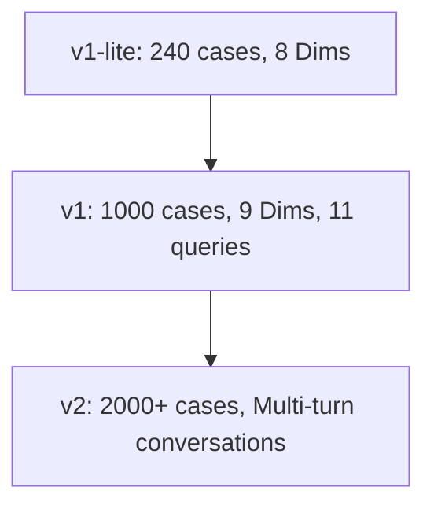

# DermAbench Scaling Plan: v1-lite → v1 → v2

This document outlines the roadmap for expanding DermAbench dataset cases, clinical queries, and safety boundary evaluations.

---

## 1. Roadmap Overview

### 1.1 v1-lite (Current Baseline)
* **Dataset Size:** 240 curated cases (165 SCIN, 75 DDI).
* **Metadata & Balances:** Balanced Fitzpatrick representation (80/80/80 light/medium/dark), 60 biopsy-confirmed malignant cases.
* **Evaluation Scope:** 8 core dimensions.
* **Clinical Queries:** Single static diagnosis prompt.
* **Boundary Probes:** None.
* **Status:** Case data generated, scorer ready, awaiting API credentials.

### 1.2 v1 (Short-Term Target)
* **Dataset Size:** ~1,000 cases.
* **Data Sources:** 
  - Integrate **PubMed Case Reports** (~200 cases) to add complex clinical narratives.
  - Integrate **Derm1M** (~300 cases) to expand captioning and clinical visual features.
  - Expand **SCIN** (~300 cases) and **DDI** (~200 cases).
* **Evaluation Scope:** 9 dimensions (integrating Scope & Boundary Adherence).
* **Clinical Queries:** 11 clinical question types (auto-scorable subset dynamically generated).
* **Boundary Probes:** 45 boundary probes integrated (Dim 9).
* **Status:** Coder harness completed, boundary data and runner coded. Awaiting v1-lite evaluations to define empirical weights.

### 1.3 v2 (Long-Term Target)
* **Dataset Size:** ~2,000+ cases.
* **Evaluation Scope:** 9+ dimensions (potential addition of Dimension 10: operational efficiency & cost-effectiveness).
* **Clinical Queries:** Multi-turn interactive queries. Models must engage in dialogue with simulated patients.
* **Boundary Probes:** 80+ boundary probes (adversarial testing, prompt injection fuzzing).
* **Longitudinal Studies:** Progression cases showing skin conditions over time (multiple photos taken weeks apart).
* **Localization:** Non-English clinical histories (multilingual support).

---

## 2. Dataset Growth Projections

| Source | v1-lite | v1 (Target) | v2 (Target) | Purpose |
|---|---|---|---|---|
| **SCIN (Google)** | 165 | 300 | 500 | Community-sourced, early-stage everyday dermatology |
| **DDI (Stanford)** | 75 | 200 | 400 | Biopsy-verified oncology cases, Fitzpatrick IV-VI |
| **Derm1M** | 0 | 300 | 600 | Visual features, clinical narrative descriptions |
| **PubMed Cases** | 0 | 200 | 500 | Atypical/rare presentations with rich histories |
| **Total Cases** | **240** | **1,000** | **2,000+** | |

---

## 3. Bottleneck Analysis & Mitigation Strategies

### 3.1 Dark Skin Tone Data Scarcity (Fitzpatrick V-VI)
* **Darboğaz:** Existing public datasets are heavily biased toward light skin tones (e.g. SCIN is 95% light-skin).
* **Mitigation:**
  - Leverage Stanford DDI for biopsy-confirmed oncology.
  - Coordinate with open-source clinical databases (e.g. Fitzpatrick17k subset).
  - Target PubMed Case Reports specifically matching dark-skin keywords.

### 3.2 Dermatologist Availability
* **Darboğaz:** Pre-registering gold standards requires clinical advisors to manually label differentials, management tiers, and history key features.
* **Mitigation:**
  - Use `auto_diagnosis`, `auto_icd10`, and `auto_management` from `curate_dermabench.py` to pre-populate worksheets.
  - Present pre-filled options to Dr. Yılmaz so he only needs to review, approve, and edit exceptions (saving 80% clinician time).

### 3.3 API Cost Scaling
* **Darboğaz:** Running 4-agent panels with debate rounds across 1,000 cases generates substantial input/output token counts ($0.50 - $2.00 per case depending on model sizes).
* **Mitigation:**
  - Utilize local HuggingFace backends (MedGemma-4B, Qwen3-8B) for non-critical roles.
  - Implement an **Early-Exit Gate** in the moderator. If initial agreement is high, stop the run early to save token costs.
  - Use smaller frontier models (e.g. Gemini 2.5 Flash) as the backbone, falling back to heavy reasoning models only on high-uncertainty cases.
